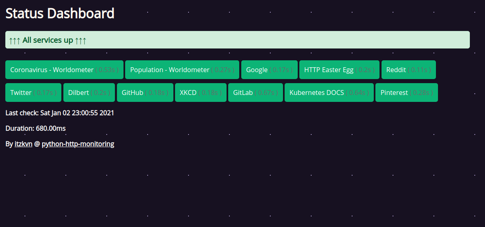

# python-http-monitoring



HTTP(s) "monitoring" powered by FastAPI+Jinja2+aiohttp.

Inspired by [bash-http-monitoring](https://github.com/RaymiiOrg/bash-http-monitoring).

Installation can be done with pipenv or Docker.
Targets can be changed on runtime since they are read in each request (if you're running on Docker just mount the file as a volume).
Request customization is also possible (retries per request, time between retries, etc.).

Targets will be flagged as "down" if they take longer than the timeout or the expected http status code is different than the one expected.

TODO (No ETA...):
```
Notifications
Historic metrics
Support other HTTP methods
```

## Installation

Minimum requirements to run locally:
- \>Python 3.7
- [pipenv](https://pypi.org/project/pipenv/)

Otherwise, if you want to run it in a container:
- Docker


Locally:

```bash
git clone https://github.com/itzkvn/python-http-monitoring.git
cd python-http-monitoring
pipenv shell
pipenv install
cd app
uvicorn main:app --port 18080
```

Docker:

If you want to try it out:

```bash
docker run -it --rm -p 18080:80 itzkvn/python-http-monitoring
```

If you want to mount a configuration file:

```bash
docker run -it --rm -p 18080:80 -v "/path/to/targets.yml:/app/targets.yml" itzkvn/python-http-monitoring
```

Either way you access the website at 127.0.0.1:18080/target/status.

## Configuration

Configuration for this proyect consists in two files:

```app/targets.yml``` and ```app/settings.py```

targets.yml: targets to check
Each target consists of:
- display: Display name in the website (Maybe you want to see "My website" instead of "http://yourwebsite.com").
- url: URL to check (ex: "https://www.google.com").
- expected_http_code: Status code that will be validated against response status code (this is, mostly, what makes a check go either green or red).

settings.py: "backend" configuration
- SESSION: Encapsulates a connection pool.
- TARGETS_FILE: Configuration file for targets.
- REQUEST_RETRIES: # of retries per url (only retries if it fails).
- REQUEST_RETRIES_WAIT: # of seconds between retries.
- REQUEST_TIMEOUT: # of seconds till timeout per request.
- REQUEST_HTTP_CODE: Default expected HTTP status code.

## Screenshots

...

## ¿Why did I make this?

Saw [bash-http-monitoring](https://github.com/RaymiiOrg/bash-http-monitoring) on [r/selfhosted](https://www.reddit.com/r/selfhosted/comments/klao26/bash_http_monitoring_dashboard/) and a weekend free to hack on something. Thought this was a fun enough challenge so here it is :)